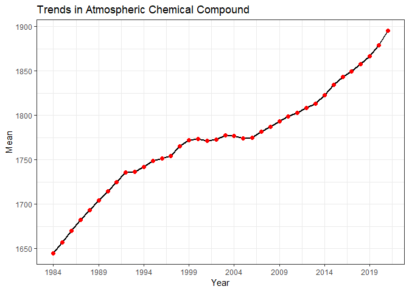

Case Study 08
================
Yixuan Zhao
10-25-2022

``` r
min_year = df$year %>% min()
max_year = df$year %>% max()
df %>% 
  mutate(sd = sd(mean)) %>% 
  as_tibble() %>% 
  ggplot(., aes(x = year, y = mean)) +
  geom_line(color = "black", lwd = 1) +
  geom_point(size = 2, color = "red") +
  scale_x_continuous(breaks = seq(min_year, max_year, 5)) +
  theme_bw() +
  labs(x = "Year", y = "Mean", 
       title= "Trends in Atmospheric Chemical Compound")
```

<!-- -->

``` r
summ = df %>% 
  slice(-1) %>% 
  mutate(Years = case_when(
    year %in% seq(1960, 1969) ~ "1960 - 1969", 
    year %in% seq(1970, 1979) ~ "1970 - 1979", 
    year %in% seq(1980, 1989) ~ "1980 - 1989", 
    year %in% seq(1990, 1999) ~ "1990 - 1999", 
    year %in% seq(2000, 2009) ~ "2000 - 2009", 
    year %in% seq(2010, 2019) ~ "2010 - 2019", 
    year %in% seq(2020, 2029) ~ "2020 -  "
  )) %>% 
  group_by(Years) %>% 
  dplyr::summarise(Mean = mean(mean), 
                   S.D. = sd(mean), 
                   Min = min(mean), 
                   Max = max(mean))
knitr::kable(summ,'simple')
```

| Years       |     Mean |      S.D. |     Min |     Max |
|:------------|---------:|----------:|--------:|--------:|
| 1980 - 1989 | 1681.548 | 18.597033 | 1657.29 | 1704.54 |
| 1990 - 1999 | 1744.591 | 17.728495 | 1714.42 | 1772.39 |
| 2000 - 2009 | 1778.246 |  7.115024 | 1771.20 | 1793.52 |
| 2010 - 2019 | 1829.700 | 23.950969 | 1798.90 | 1866.59 |
| 2020 -      | 1887.125 | 11.589480 | 1878.93 | 1895.32 |
